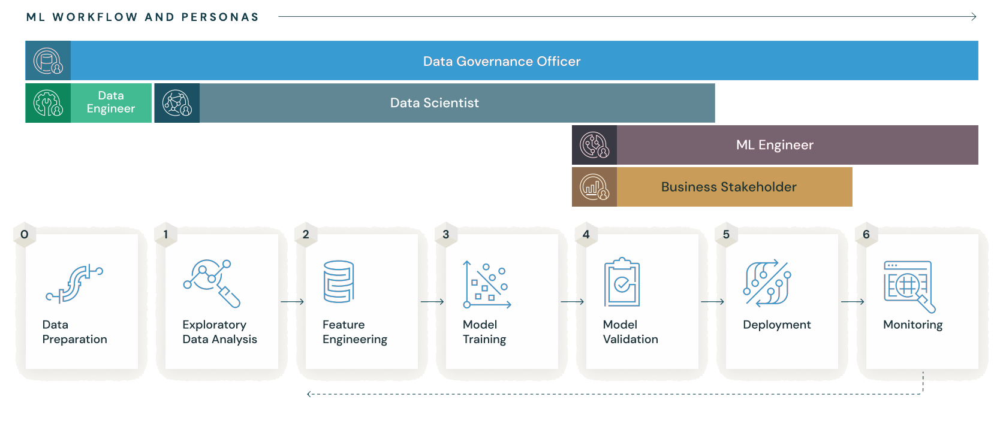

# **MLflow**  

MLflow is an open-source platform designed to manage the **machine learning (ML) lifecycle**, including **experimentation, reproducibility, and deployment**. It provides tools to track experiments, package models, and deploy them in various environments.  

---

## **🔹 Key Components of MLflow**  
1️⃣ **MLflow Tracking** – Logs and tracks ML experiments, including parameters, metrics, and artifacts.  
2️⃣ **MLflow Projects** – Defines reusable and reproducible ML code workflows.  
3️⃣ **MLflow Models** – Standard format to package ML models for deployment.  
4️⃣ **MLflow Registry** – Centralized model store for versioning and lifecycle management.  

---

## **🛠️ Installation**  
Run the following command to install MLflow:  

```bash
pip install mlflow
```

---

## **🚀 Basic Example**  
Here’s a simple example to log parameters and metrics using MLflow:  

```python
import mlflow

mlflow.start_run()
mlflow.log_param("alpha", 0.5)
mlflow.log_metric("accuracy", 0.85)
mlflow.end_run()
```

---

## **📢 Viewing the MLflow UI**  
To access the MLflow UI and track experiments, follow these steps:  

### **1️⃣ Start the MLflow Tracking Server**  
Navigate to your working directory and run:  

```bash
mlflow ui
```

By default, this starts the UI at:  
📍 **http://127.0.0.1:5000**  

---

### **2️⃣ Use a Different Port (If Needed)**  
If port `5000` is already in use, start MLflow on another port:  

```bash
mlflow ui --port 8080
```

Now, access the UI at:  
📍 **http://127.0.0.1:8080**  

---

### **3️⃣ Running MLflow on a Remote Server**  
If you're using a remote server, allow external access with:  

```bash
mlflow ui --host 0.0.0.0
```

Then, access it via:  
📍 `http://<server-ip>:5000`  

---

## **✅ Why Learn MLflow?**  

1️⃣ **Standardized Experiment Tracking** 📊  
   - Helps log and compare different model runs, hyperparameters, and performance metrics.  
   - Essential for **reproducibility** in ML projects.  

2️⃣ **Seamless Model Packaging & Deployment** 🚀  
   - Provides a standard way to package models across frameworks like **TensorFlow, PyTorch, Scikit-learn, and XGBoost**.  
   - Supports **multiple deployment options**, including cloud services like AWS, Azure, and GCP.  

3️⃣ **Model Versioning & Registry** 🔄  
   - Keeps track of different versions of trained models.  
   - Enables smooth collaboration in **team environments**.  

4️⃣ **Integration with Popular Tools** 🔌  
   - Works well with **Kubeflow, Airflow, Spark, and Kubernetes**.  
   - Supports cloud-based storage like **AWS S3, Azure Blob, and Google Cloud Storage**.  

5️⃣ **Industry Adoption & Career Growth** 📈  
   - Used by top companies for **MLOps & production ML pipelines**.  
   - Learning MLflow can enhance your career in **ML Engineering, Data Science, and MLOps**.  





